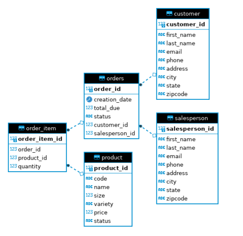

# Introduction
The application interacts with postgresql database hosted locally using docker containers and performed CRUD operations. The app allows users to connect to a database with the java application and RDBMS and run SQL queries. It is implemented following the Data Access Object design pattern. 

## Technologies Used
 - Java
 - JDBC
 - PostgresSQL
 - Maven
 - Docker

# Implementaiton
## ER Diagram

## Design Patterns

### Data Access Object Model (DAO)

The Data Access Object design pattern allows you to isolate the application/business layer from the persistence layer by way of an abstract API. This design pattern allows the API to be hidden from the application all the underlying functionality of performing CRUD operations. In this JDBC implementation the 'CustomerDAO' class was implemented to enable CRUD operations on a PostgreSQL database, 'hplussport'. Thereafter, a Data Transfer Object (DTO), namely 'Customer' class was created to represent a relation (i.e. Customer table)
within the database. Finally, CRUD operations were performed in the 'JDBCExecutor' class to process the data.

### Respository Desgin Pattern 

The repository design pattern is similar to the DAO design pattern but it differs from it in that it is closer to the business logic of an app. Furthermore, the repository pattern allows for sharding of a database.

# Test

The application had been tested manually against the database. An instance of a test database was created where the crud operations were performed on it to verify if the results matched the expected results.

