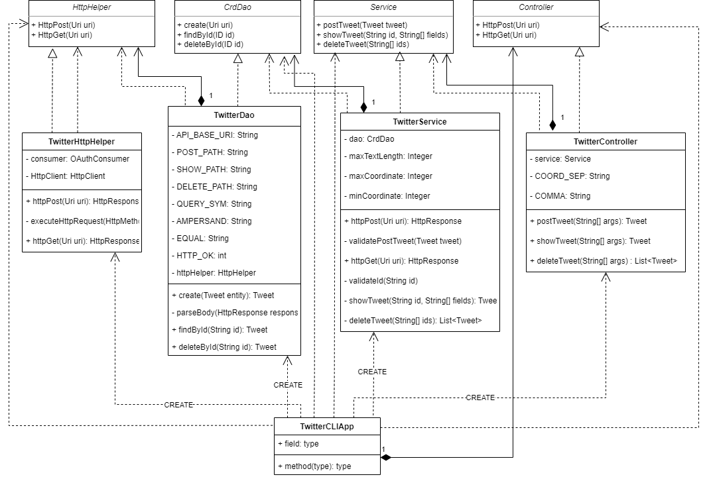

# Introduction
(50-100 words)
What does this app do? What technoglies you have used? (e.g. Twitter REST API, HTTP client, mvn, Java libs, docker etc..)

The Java application allows you to create, show or delete tweets from the command line, 
by connecting through the Twitter REST API. To create a tweet it takes 2 arguments, one being the text
you want to tweet and other is the geolocation. To show a tweet we need the id of the tweet we want to
show, likewise we need the id to delete the tweet as well. After creating the application, we utilized
Maven to package the application and create a Dockerfile that is uploaded to dockerhub. 

### Technologies Used:
- Java
- Maven
- Twitter REST API
- Spring Framework
- Docker 
- Junit4 (Integration & Unit Testing)
- Mockito


# Quick Start
- how to package your app using mvn?
- how to run your app with docker?

We packaged our application using Maven with the following command:

Package using Maven:
```
mvn clean compile package
``` 

This creates a packaged 'jar' file which will be used to create the docker image. 
This was then uploaded to dockerHub and can be pulled using `pull docker osama252/twitter_app`. 

Run using Dockers:
```
docker run --rm  
-e consumerKey=${consumerKey} 
-e consumerSecret=${consumerSecret} 
-e accessToken=${accessToken} 
-e tokenSecret=${tokenSecret} 
${docker_user}/twitter_app post <Text> <latitiude:Longitude>
```

Run using jar File:
```shell
java -jar path-to-file post|delete|show [parameters]
```

# Design
## UML diagram


## explain each component(app/main, controller, service, DAO) (30-50 words each)

### Controller 
The controller class main purpose is to take in arguments from the user and call upon
the correct methods.

### Service
This class handles the business logic of the application. This is where formatting of
the inputs are checked to see if they are correct. 

### CrdDao
This constructs the Twitter REST HTTP URI for different HTTP calls using the helper interface.

### HttpHelper
Helper class to authenticate and execute HTTP 'get' and 'post' requests.  

###TwitterCLIApp
Here we utilize spring framework to handle dependencies and run the application. 


## Models
Talk about tweet model

Models are implmented using plan old java objects (POJO), where we utilize excapsulation by having
private variables and use public getters and setters. This application we used a Tweet Model as
Data Transfer Object(DTO) and data access model.

- Coordinates
- Entities
- Hashtags
- Tweet 
- UserMentions

### Sample Tweet Model
```json
{
  "created_at" : "Fri Jun 26 17:32:16 +0000 2020",
  "id" : 1276568976764686343,
  "id_str" : "1276568976764686343",
  "text" : "test post",
  "entities" : {
    "hashtags" : [ ],
    "user_mentions" : [ ]
  },
  "coordinates" : {
    "coordinates" : [ 79.0, 43.0 ],
    "type" : "Point"
  },
  "retweet_count" : 0,
  "favorite_count" : 0,
  "favorited" : false,
  "retweeted" : false
}
```

## Spring
The Spring framework allows us to define the dependencty relationship so the Inversion of Control(IOC)
container will create the required components in the correct order. Then we can simply call the `run`
method in the TwitterCLIApp class. 

# Test
We have implemented several tests for each component using JUnit and Mockito for mocking dependencies.
For unit testing we used Mockito and JUnit4 for integration testing. 


## Deployment
How did you dockerize your app.
The image was built and pushed to dockerhub. The following are the steps used:

Create Dockerfile: 
```shell
cat > Dockerfile << EOF
FROM openjdk:8-alpine
COPY target/twitter*.jar /usr/local/app/twitter/lib/twitter_app.jar
ENTRYPOINT ["java","-jar","/usr/local/app/twitter/lib/twitter_app.jar"]
EOF
```
Package App to Jar and Verify Image:
```shell
#Pakcage your java app
mvn clean package
#build a new docker image locally
docker build -t ${docker_user}/twitter_app .
#verify your image
docker image ls
```
Push to DockerHub:
```shell
docker push ${docker_user}/twitter_app
```

# Improvements
- We can implement more Twitter methods instead of post|show|delete. 
- Improve integration and unit testing by allowing manipulating tweets for testing purposes.
- Using a full version of Tweet Object rather than simplified one to create tweets. 